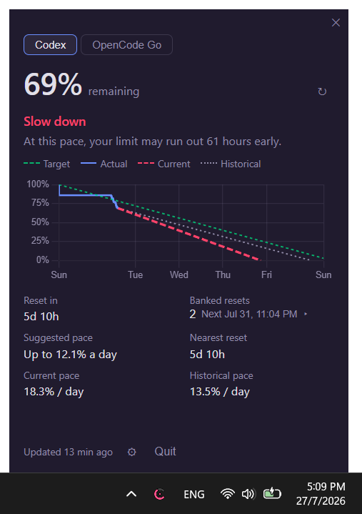

# Codex Dial

A small-ish, fast Windows tray utility with a nice graph that tracks your Codex/OpenCode Go rate limits and helps you pace yourself. 
Ported from [thrr87/codex-limits](https://github.com/thrr87/codex-limits) (macOS) to Windows using Tauri 2, Rust, and Svelte.



## What it does

- Reads usage from your configured backend(s) over JSON-RPC (Codex CLI) or HTTPS (OpenCode Go)
- Shows a burn-down chart with four projections: target, actual, current pace, and historical pace
- Gives a plain-language verdict: **Slow down**, **On track**, or **Room to use more**
- Dynamic tray icon — a C-shaped arc that depletes as your quota burns (turns pink/red when you're going too fast)
- Shows banked reset count and the next expiry; click it to inspect all reset deadlines returned by Codex CLI
- Tracks 90 days of usage history in local JSON files
- Optional folder sync (OneDrive, Dropbox, etc.) to share history across machines
- Refreshes every 10 minutes, on wake from sleep, or manually

## Backend selection

Codex Dial supports two independent usage backends:

- **Codex CLI** — reads rate limits from the signed-in Codex CLI over JSON-RPC (stdio).
- **OpenCode Go** — fetches usage from `opencode.ai` using an authenticated session cookie.

You only need one backend. Open **Settings → Usage backends** to enable or disable either integration. Both can be enabled if you want to compare their usage, or left disabled until you are ready to configure a provider.

To use OpenCode Go:

1. Enable **OpenCode Go** in **Settings**.
2. Copy your `auth` or `__Host-auth` session cookie from your browser's developer tools (**Application → Cookies**).
3. Paste the cookie into Codex Dial and select **Save**.
4. Refresh the dashboard. If automatic workspace discovery does not work, paste the `wrk_...` workspace ID as an override in Settings.

The session cookie is saved in the app's local configuration and acts like a password. Treat it as sensitive, do not share it, and remove or replace it if it is exposed. OpenCode Go depends on authenticated web responses from `opencode.ai`, so expired cookies or upstream website changes can cause that backend to show an error.

## Stats at a glance

| Left | Right |
|------|-------|
| Reset in (relative time) | Banked resets (count + next expiry) |
| Suggested pace (%/day) | Nearest reset deadline |
| Current pace (%/day) | Historical pace (%/day) |

Click the **Banked resets** value to see the available reset deadlines. Codex CLI
versions that expose only the count will still show the count, but the deadline
list will explain that details were not returned.

## Requirements

- Windows 10/11
- A configured usage backend for live data:
  - A signed-in [Codex CLI](https://github.com/openai/codex) installation (`codex` or `codex.cmd` on PATH), or
  - An OpenCode Go account and an active browser session cookie

## Install

Grab the latest `.exe` installer from [Releases](../../releases).

## Build from source

### Prerequisites

- [Rust](https://rustup.rs/) (the repository pins the `stable-x86_64-pc-windows-msvc` toolchain)
- [Node.js](https://nodejs.org/) 18+
- [Visual Studio 2022 Build Tools](https://visualstudio.microsoft.com/visual-cpp-build-tools/) with:
  - **Desktop development with C++**
  - MSVC v143 (or newer) C++ build tools for x64/x86
  - A Windows 10 or Windows 11 SDK
- [Tauri 2 prerequisites](https://v2.tauri.app/start/prerequisites/) (including WebView2)
- A signed-in Codex CLI installation for live Codex data, or an OpenCode Go browser session cookie

The Rust target is configured in `.cargo/config.toml` as
`x86_64-pc-windows-msvc`, so builds use Microsoft's linker instead of the
GNU toolchain. The `rust-toolchain.toml` file selects the matching Rust
toolchain automatically.

### Open an MSVC developer shell

Build from **Developer PowerShell for VS 2022** or **x64 Native Tools Command
Prompt for VS 2022**. These shells put `cl.exe`, `link.exe`, and the Windows
SDK on `PATH`. Verify the shell before building:

```powershell
rustup show active-toolchain
where.exe cl.exe
where.exe link.exe
```

The active toolchain should end in `-pc-windows-msvc`, and `where.exe` should
resolve the Visual Studio tools rather than a `link.exe` shipped by Git or a
MinGW installation. If `cl.exe` is not found, install the C++ workload above
and open the Visual Studio developer shell again.

If Visual Studio Build Tools is already installed, open **Visual Studio Installer**
from the Start menu, choose **Modify** for the Build Tools installation, and
enable the components listed above. Close existing terminals after installation
and open a fresh developer shell. Do not build from Git Bash unless it inherits
the Visual Studio environment; Git Bash commonly exposes its own GNU
`/usr/bin/link.exe`, which is not the MSVC linker.

### Steps

```powershell
git clone https://github.com/int3rrobang/codex-dial.git
cd codex-dial
npm install

# Build the frontend only
npm run build

# Run the complete desktop app in development mode with hot reload
npm run tauri dev

# Build production Windows installers
npm run tauri build
```

If `tauri dev` reports that it is waiting for a build-directory lock, stop
any other running Tauri or Cargo development process with `Ctrl+C` and run the
command again. Vite is configured to ignore Rust's `src-tauri/target` output,
so Cargo build artifacts do not trigger frontend watcher errors.

Production installers are written under:

```
src-tauri/target/x86_64-pc-windows-msvc/release/bundle/nsis/
src-tauri/target/x86_64-pc-windows-msvc/release/bundle/msi/
```

The Codex and OpenCode Go integrations are part of the Rust backend and are
included automatically in both development and production Tauri builds. No
separate backend service is required.

## Tech stack

| Layer | Technology |
|-------|-----------|
| Backend | Rust (Tauri 2) |
| Frontend | Svelte 5 + TypeScript |
| Charts | Chart.js |
| Tray icon | Canvas → Tauri Image API (dynamic, no static assets) |
| Persistence | JSON files in `%APPDATA%\com.github.thrr87.CodexLimits\History\` |
| IPC | Tauri commands (async, tokio) |

## How it polls

- **On launch** — immediate refresh
- **Every 10 minutes** — background timer
- **On wake from sleep** — 30s heartbeat detects time gaps
- **Manual** — tray menu or refresh button
- **Banked reset details** — fetched with the same Codex rate-limit snapshot; older Codex CLI builds may provide only the count

## Credits

- Original macOS app: [thrr87/codex-limits](https://github.com/thrr87/codex-limits)
- Codex Dial is an independent, unofficial project. Not affiliated with or endorsed by OpenAI.

## License

[MIT](LICENSE)
